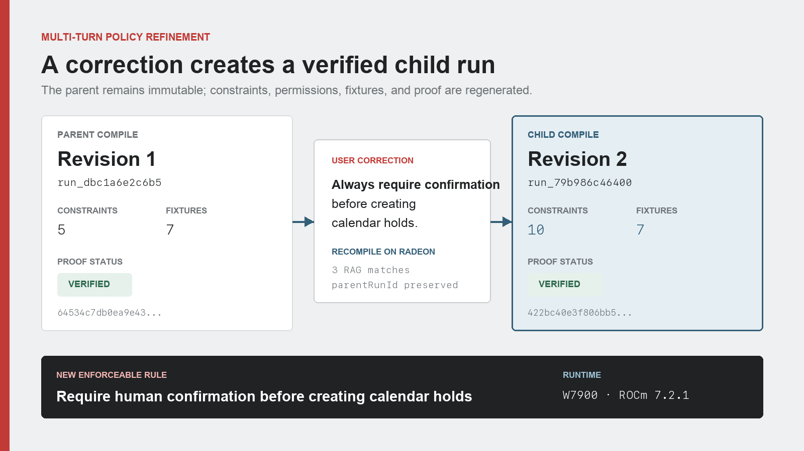

# Multi-Turn Policy Refinement

Radeon Voice Skill Foundry treats a correction as a new governed compile run,
not as an in-place text edit. The parent run remains available as immutable
provenance, while the child run receives regenerated constraints, permissions,
fixtures, and a new proof hash.

## Watch First

- [35.5-second multi-turn Director Cut](https://github.com/Chengyuann/radeon-voice-skill-foundry/releases/download/submission/MULTI_TURN_INTERACTION_DIRECTOR_CUT.mp4)
- [Raw 32-second product capture](https://github.com/Chengyuann/radeon-voice-skill-foundry/releases/download/submission/MULTI_TURN_INTERACTION_DEMO.mp4)
- [Current three-turn UI screenshot](MULTI_TURN_INTERACTION_DEMO.png)

The Director Cut is intentionally separate from the 4:49 Product Demo. It uses
real product footage, hard captions, a project-owned original procedural
soundtrack, and locally generated VoxCPM2 narration using the
`young-sunny-magnetic-male-en` profile. It shows
revision 1, a natural-language correction creating revision 2, verification of
revision 2, and a second correction creating revision 3 with verification
required again.

## Verified Interaction

The user supplied this natural-language correction:

> Always require confirmation before creating calendar holds.

The public Radeon workflow produced:

| Evidence | Parent run | Child run |
|---|---|---|
| Revision | `1` | `2` |
| Run ID | `run_dbc1a6e2c6b5` | `run_79b986c46400` |
| Parent link | root compile | `run_dbc1a6e2c6b5` |
| Constraints | `5` | `10` |
| Generated fixtures | `7` | `7` |
| Verification | verified | verified |
| Proof hash | `64534c7d...504cf69f` | `422bc40e...ead6522` |

The child run added the requested rule:

> Require human confirmation before creating calendar holds.

It also retained fail-closed restrictions on automatic email or calendar
sending, sensitive-data redaction, missing-owner confirmation, and missing-date
handling.

## Interaction Surface

The current Policy module makes the governed conversation visible instead of
presenting only the latest compiled document:

- each turn shows the operator instruction and revision number
- parent and child run IDs remain visible in the same timeline
- rule additions, removals, capability changes, and regenerated test counts
  are summarized per turn
- verified and quarantined states remain attached to their original turns
- creating another child immediately returns the new current turn to
  `compiled`, with verification required again
- suggested corrections provide fast entry points without hiding the editable
  natural-language input

This UI is backed by persisted `revisionHistory` data on new compile runs, not
by a client-only chat transcript. New proof packages serialize that contract
as `revision_history.json`. The pinned public Radeon screenshot and proof below
remain the verified revision-2 submission evidence.

## What Changes

1. The user correction is appended as a new revision input.
2. Local policy evidence is retrieved again.
3. The Radeon-hosted Agent compiler regenerates the structured constraints.
4. Permissions, Agent Skill Markdown, policy YAML, and fixtures are rebuilt.
5. Verification runs again and produces a new proof hash.
6. The child proof records both `revision: 2` and the parent `runId`.
7. New runs retain the complete sequence of instructions, deltas, fixture
   counts, and proof states for subsequent turns.

The system does not present the child as verified until the regenerated
fixtures and sandbox replay pass.

## Evidence

- [Compact lineage diagram](MULTI_TURN_LINEAGE.png)
- [Full live product screenshot](MULTI_TURN_REFINEMENT.png)
- [Lineage and runtime metadata](MULTI_TURN_REFINEMENT.json)
- [Verified child proof package](MULTI_TURN_REFINEMENT_PROOF.zip)
- [Verified parent proof package](VERIFIED_WORKFLOW_PROOF.zip)
- Source behavior:
  [`server/compiler.ts`](https://github.com/Chengyuann/radeon-voice-skill-foundry/blob/main/server/compiler.ts),
  [`server/verifier.ts`](https://github.com/Chengyuann/radeon-voice-skill-foundry/blob/main/server/verifier.ts),
  and
  [`server/compiler.test.ts`](https://github.com/Chengyuann/radeon-voice-skill-foundry/blob/main/server/compiler.test.ts)

## Runtime

- Radeon Pro W7900-class `gfx1100`, 48 GB
- ROCm 7.2.1
- Qwen3-4B-Instruct-2507
- Qwen3-ASR-0.6B
- Three local knowledge matches in the captured child run

This evidence demonstrates traceable multi-turn policy correction. It is
supplementary to the recorded Product Demo and does not change the pinned
performance measurements.
